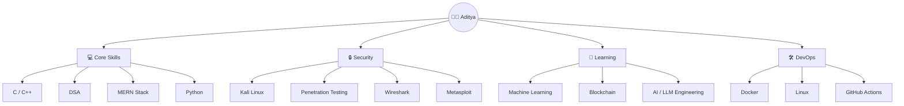

<div align="center">

```
╔═══════════════════════════════════════════════════════════════╗
║                                                               ║
║    ██████╗ ██████╗ ██╗████████╗██╗   ██╗ █████╗              ║
║   ██╔══██╗██╔══██╗██║╚══██╔══╝╚██╗ ██╔╝██╔══██╗             ║
║   ███████║██║  ██║██║   ██║    ╚████╔╝ ███████║             ║
║   ██╔══██║██║  ██║██║   ██║     ╚██╔╝  ██╔══██║             ║
║   ██║  ██║██████╔╝██║   ██║      ██║   ██║  ██║             ║
║   ╚═╝  ╚═╝╚═════╝ ╚═╝   ╚═╝      ╚═╝   ╚═╝  ╚═╝             ║
║                                                               ║
║              D A B G O T R A . T E C H                        ║
╚═══════════════════════════════════════════════════════════════╝
```


<br/>

[](https://github.com/AdityaDabgotra)
[](https://github.com/AdityaDabgotra)
[](https://github.com/AdityaDabgotra)

</div>

---


### `whoami`

```bash
$ cat profile.json
{
  "name"      : "Aditya Dabgotra",
  "role"      : "Full Stack Dev & Security Researcher",
  "location"  : "India 🇮🇳",
  "focus"     : ["DSA", "MERN", "CyberSec", "AI"],
  "currently" : "Breaking things to build better ones",
  "motto"     : "Code. Break. Secure. Repeat.",
  "coffee"    : true,
  "open_to"   : "Collabs & Opportunities"
}
```

<br clear="right"/>

---

## ⚡ System Architecture



---

## 🛸 Tech Arsenal

<table>
<tr>
<td valign="top" width="33%">

### 🧠 Languages


</td>
<td valign="top" width="33%">

### 🌐 Web Stack


</td>
<td valign="top" width="33%">

### 🔒 Security


</td>
</tr>
<tr>
<td valign="top">

### 🛠️ DevOps


</td>
<td valign="top">

### 🗄️ Databases


</td>
<td valign="top">

### 🤖 AI/ML


</td>
</tr>
</table>

---

## 🔥 DSA War Record

> *"Algorithms are my weapon of choice."*

<div align="center">

[](https://leetcode.com/)
[](https://codeforces.com/)
[](https://www.geeksforgeeks.org/)

</div>

```
🗡️  Arrays & Hashing       ████████████████████  MASTERED
🗡️  Trees & Graphs         ███████████████░░░░░  ADVANCED
🗡️  Dynamic Programming    ██████████████░░░░░░  ADVANCED
🗡️  Linked Lists           ████████████████████  MASTERED
🗡️  Bit Manipulation       █████████████░░░░░░░  ADVANCED
🗡️  System Design          ████████░░░░░░░░░░░░  IN PROGRESS
```

---

## 🚀 Active Projects

<table>
<tr>
<td width="50%">

### 🧠 Notes Summariser (YouTube)
> Turn lectures into study notes: captions → Gemini summaries, flashcards, quizzes—saved per user

**Stack:** React · Node.js · Gemini API  
**Status:** `🟢 Active`

[](https://github.com/AdityaDabgotra/Notes_summariser)

</td>
<td width="50%">

### 🤝 DevCollab
> Where developers meet projects—discover, apply, and build together

**Stack:** TypeScript · Full stack · Vercel  
**Status:** `🟢 Active`

[](https://github.com/AdityaDabgotra/DevCollab)

</td>
</tr>
<tr>
<td width="50%">

### 🚗 Car Damage Analyser
> CV maps body regions from damage clips; an LLM outputs insurer-ready repair vs replace recommendations

**Stack:** TypeScript · Computer Vision · LLM  
**Status:** `🟢 Active`

[](https://github.com/AdityaDabgotra/Car_Damage_Analyser)

</td>
<td width="50%">

### 🔒 Cyber Security Lab *(WIP)*
> Personal CTF writeups, pentest notes & exploit scripts

**Stack:** Python · Kali · Metasploit  
**Status:** `🔵 Research Phase`

[](https://github.com/AdityaDabgotra/)

</td>
</tr>
</table>

---

## 📊 GitHub Command Center

<div align="center">
  
  
</div>

<div align="center">
  
</div>

<div align="center">
  
</div>

---

## 🏆 Hall of Fame

<div align="center">
  <a href="https://github.com/ryo-ma/github-profile-trophy">
    
  </a>
</div>

---

## 📡 Currently Hacking On

```javascript
const aditya = {
  currentlyLearning : ["Penetration Testing", "LLM Engineering", "Blockchain Dev"],
  building          : ["AI Tools", "Security Scripts", "Full Stack Apps"],
  reading           : ["The Web Application Hacker's Handbook", "CLRS Algorithms"],
  funFact           : "I debug with console.log and I'm not ashamed.",
  availableFor      : "Open source collabs, freelance, & full-time roles 🚀"
};
```

---

## 🌌 Connect & Collaborate

<div align="center">

[](mailto:adityadabgotra2004@gmail.com)
[](https://linkedin.com/in/aditya-dabgotra-279a0a162)
[](https://twitter.com/YourTwitter)
[](https://adityadabgotratech.vercel.app/)

</div>

---

<div align="center">

```
╔══════════════════════════════════════════╗
║  "First, solve the problem.              ║
║   Then, write the code."                 ║
║                        — John Johnson    ║
╚══════════════════════════════════════════╝
```


</div>
