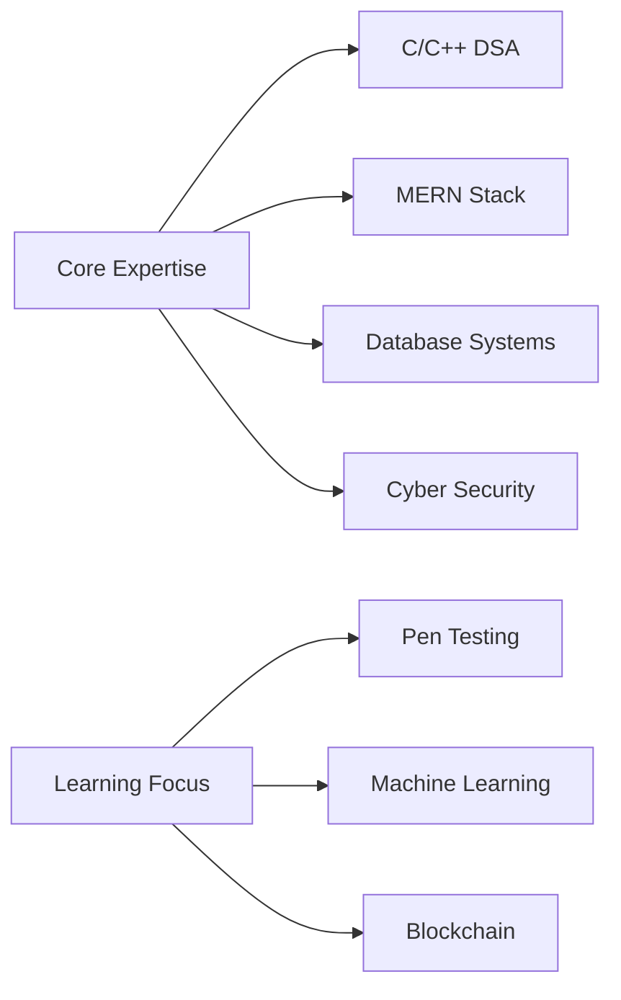

<h1 align="center">🚀 Hi, I'm Aditya Dabgotra</h1>
<h3 align="center">⚡ Tech Enthusiast & DSA Specialist</h3>

  

---

## 🔮 Tech Profile

## ⚙️ Tech Stack & Tools

### 🧠 Core Languages

### 🌐 Web Technologies

### 🔒 Security Tools

### 🛠️ DevOps & Tools

---

## 📊 GitHub Analytics

  

---

## 🏆 Achievements

  

  

---

## ✨ Active Projects

- 🧠 **[AI powered Youtube Video Notes Maker](https://github.com/AdityaDabgotra/)** - Get Short Notes and Bullet Points for a Youtbe Video
- 🌐 **[E-Commerce MERN Platform](https://github.com/AdityaDabgotra/)** - Full-featured shopping system
- 🧠 **[AI Chess Game](https://github.com/AdityaDabgotra/Chess_Ai)** - Interactive Chess Game to battle against Stockfish

---

## 🌌 Connect With Me

  
  
  
  

---

  

