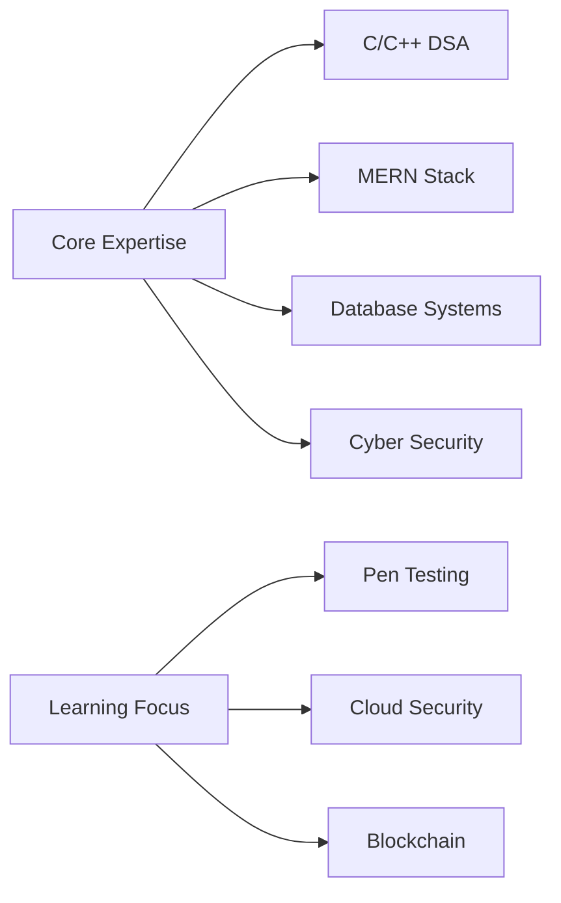

<h1 align="center">🚀 Hi, I'm Aditya Dabgotra</h1>
<h3 align="center">⚡ Tech Enthusiast & DSA Specialist</h3>

  

  

---

## 🔮 Tech Profile

  

⚙️ Tech Stack & Tools
🧠 Core Languages
https://img.shields.io/badge/c-%252300599C.svg?style=for-the-badge&logo=c&logoColor=white
https://img.shields.io/badge/c++-%252300599C.svg?style=for-the-badge&logo=c%252B%252B&logoColor=white
https://img.shields.io/badge/python-3670A0?style=for-the-badge&logo=python&logoColor=ffdd54

🌐 Web Technologies
https://img.shields.io/badge/MongoDB-%25234ea94b.svg?style=for-the-badge&logo=mongodb&logoColor=white
https://img.shields.io/badge/express.js-%2523404d59.svg?style=for-the-badge&logo=express&logoColor=%252361DAFB
https://img.shields.io/badge/react-%252320232a.svg?style=for-the-badge&logo=react&logoColor=%252361DAFB
https://img.shields.io/badge/node.js-6DA55F?style=for-the-badge&logo=node.js&logoColor=white
https://img.shields.io/badge/redux-%2523593d88.svg?style=for-the-badge&logo=redux&logoColor=white

🔒 Security Tools
https://img.shields.io/badge/Kali-268BEE?style=for-the-badge&logo=kalilinux&logoColor=white
https://img.shields.io/badge/Wireshark-1679A7?style=for-the-badge&logo=wireshark&logoColor=white
https://img.shields.io/badge/Metasploit-EF2D5E?style=for-the-badge

🛠️ DevOps & Tools
https://img.shields.io/badge/github-%2523121011.svg?style=for-the-badge&logo=github&logoColor=white
https://img.shields.io/badge/docker-%25230db7ed.svg?style=for-the-badge&logo=docker&logoColor=white
https://img.shields.io/badge/Linux-FCC624?style=for-the-badge&logo=linux&logoColor=black

📊 GitHub Analytics

  

🏆 Achievements

  

  

✨ Active Projects
<!-- PROJECTS:START -->
🔒 CyberSec Toolkit - Security utilities collection

🌐 E-Commerce MERN Platform - Full-featured shopping system

🧠 Algorithm Visualizer - Interactive DSA learning tool

<!-- PROJECTS:END -->
🌌 Connect With Me

     

  

  

